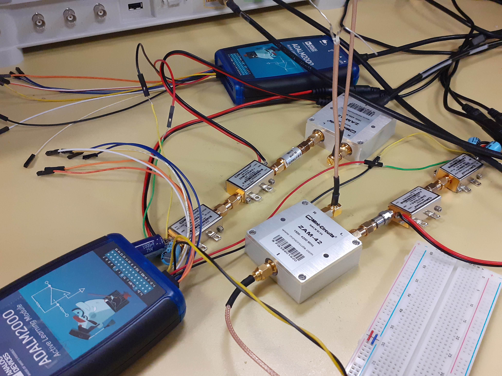
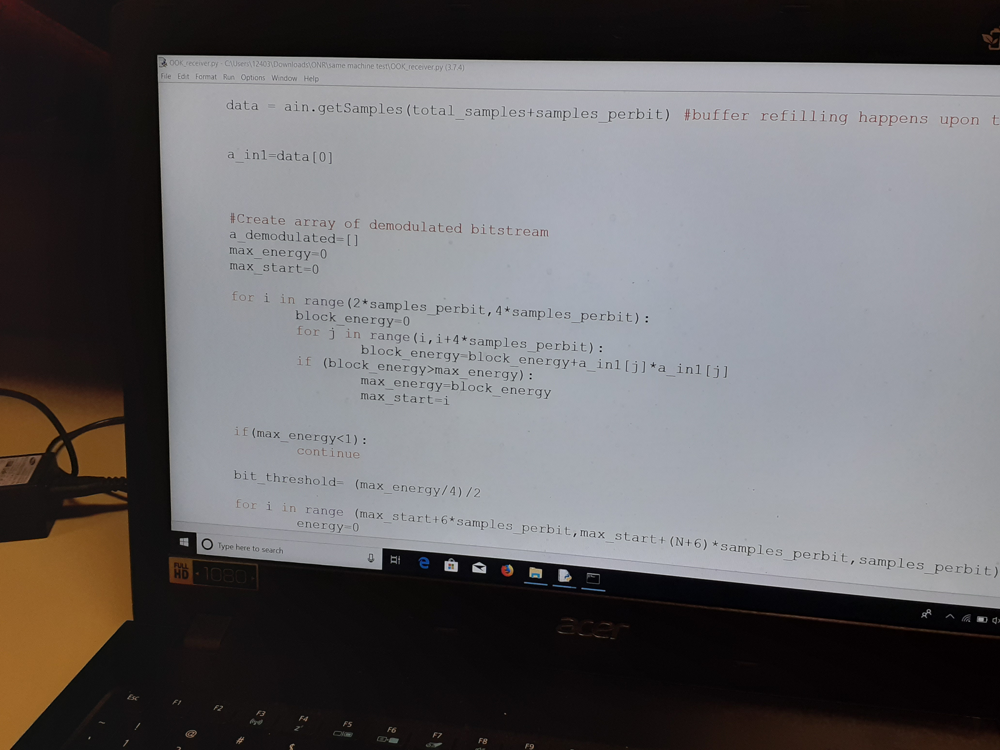
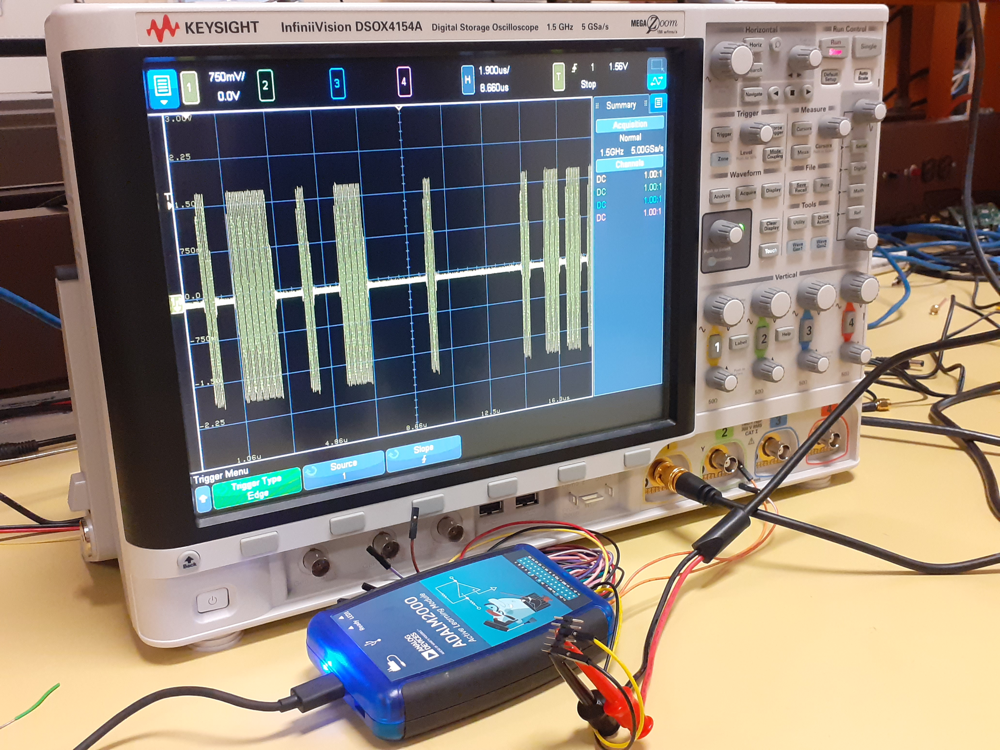



# [RadioWare: Courseware and Lab Kit for Interference-Limited Communications and Electronic Defense](#)

This project focuses on the development and enhancement of a software-defined radio (SDR) communication system, designed to provide students with practical experience in both commercial wireless technologies (e.g., 5G, WiFi) and military applications such as electronic warfare and sensing. By addressing the challenges of increasingly congested and contested radio frequency (RF) spectrum environments, the project combines foundational learning with hands-on implementation. Starting with a functional wired transmission model, participants will progressively build a wireless system that addresses key challenges such as propagation effects, interference, and noise. Through this process, students gain an enhanced understanding of wireless communication principles by tackling real-world problem-solving scenarios, develop essential engineering skills such as programming (Python, C), hardware testing, and system debugging, and prepare for advanced prototyping, research projects, and deeper studies in communication systems.
<table>
  <tr>
    <td align="center">
       
      <b>RF Modules</b>
    </td>
    <td align="center">
       
      <b>Python Code</b>
    </td>
    <td align="center">
       
      <b>Measurement Equipment</b>
    </td>
  </tr>
</table>

## Key Contributions
- **SDR Communication System Development**: Designed and implemented baseband signal processing boards with extensive modification and verification.
- **Simulation and Analysis**: Modeled signal flow and communication scenarios using Python, enabling detailed system design and performance analysis.
- **Measurement and Testing**: Integrated Python-based control for hardware, including ADALM, oscilloscopes, spectrum analyzers, and FieldFox, to validate system functionality under real-world conditions.

This project offers a comprehensive learning experience that combines conceptual depth, technical expertise, and practical application, providing students with the skills and knowledge to excel in modern RF communication environments.

Publications
======
  <ul>
    
  </ul>
  
Talks
======
  <ul>
    
  </ul>
  
Teaching
======
  <ul>
    
  </ul>
  
Service and leadership
======
* Currently signed in to 43 different slack teams