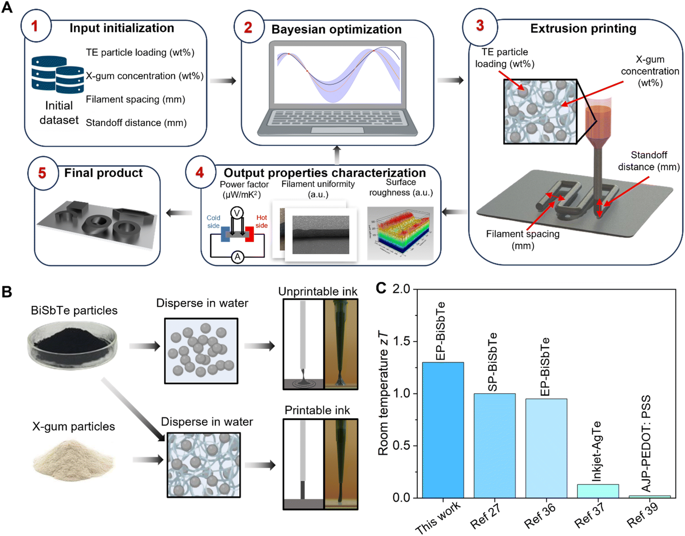



## [High-Performance Thermoelectric Materials via Extrusion Printing and Machine Learning](https://pubs.rsc.org/en/content/articlehtml/2024/ta/d4ta03062a)

This project focuses on leveraging extrusion printing and machine learning to revolutionize thermoelectric device fabrication. Traditional manufacturing methods are costly and restricted to simple geometries, limiting their broader application. By integrating high-throughput experimentation with Bayesian optimization, this work accelerates the optimization of ink formulations and printing parameters, enabling the fabrication of complex 3D thermoelectric structures with exceptional performance. The approach demonstrates a significant leap in thermoelectric materials research, achieving an ultrahigh room temperature zT of 1.3 in printed BiSbTe-based materials—the highest reported for printed thermoelectrics.
<table>
  <tr>
    <td align="center">
       
    <b>Workflow of the machine learning-assisted extrusion printing of thermoelectric inks</b>
    </td>  
    </tr>
</table>

## Key Contributions

- **Integration of Machine Learning**: Implemented a Gaussian process regression (GPR)-based model to predict thermoelectric power factors efficiently, enabling rapid optimization of ink formulations and printing parameters.
- **Optimization via Bayesian Methods**: Leveraged Bayesian optimization (BO) to significantly accelerate the search for high-performance printing conditions, achieving exceptional thermoelectric performance while maintaining shape fidelity.
- **Scalable and Generalizable Approach**: Showcased a machine learning-guided ink-based printing strategy that can be applied to a wide range of functional materials and devices, paving the way for broader technological applications.

## [RadioWare: Courseware and Lab Kit for Interference-Limited Communications and Electronic Defense](#radioware)

This project focuses on the development and enhancement of a software-defined radio (SDR) communication system, designed to provide students with practical experience in both commercial wireless technologies (e.g., 5G, WiFi) and military applications such as electronic warfare and sensing. By addressing the challenges of increasingly congested and contested radio frequency (RF) spectrum environments, the project combines foundational learning with hands-on implementation. Starting with a functional wired transmission model, participants will progressively build a wireless system that addresses key challenges such as propagation effects, interference, and noise. Through this process, students gain an enhanced understanding of wireless communication principles by tackling real-world problem-solving scenarios, develop essential engineering skills such as programming (Python, C), hardware testing, and system debugging, and prepare for advanced prototyping, research projects, and deeper studies in communication systems.
<table>
  <tr>
    <td align="center">
       
      <b>RF Modules</b>
    </td>
    <td align="center">
       
      <b>Python Code</b>
    </td>
    <td align="center">
       
      <b>Measurement Equipment</b>
    </td>
  </tr>
</table>

## Key Contributions
- **SDR Communication System Development**: Designed and implemented baseband signal processing boards with extensive modification and verification.
- **Simulation and Analysis**: Modeled signal flow and communication scenarios using Python, enabling detailed system design and performance analysis.
- **Measurement and Testing**: Integrated Python-based control for hardware, including ADALM, oscilloscopes, spectrum analyzers, and FieldFox, to validate system functionality under real-world conditions.

This project offers a comprehensive learning experience that combines conceptual depth, technical expertise, and practical application, providing students with the skills and knowledge to excel in modern RF communication environments.

## [Enhanced Anomaly Detection in Brain MRI Using Image Quality Assessment](https://an-xu.github.io/MedAD-IQA.github.io/)

This project focuses on rethinking reconstruction-based anomaly detection in brain MRI from the perspective of image quality assessment, a less explored yet impactful angle in medical imaging. By introducing a novel fusion quality loss function combining Structural Similarity Index Measure (SSIM) loss and ℓ1 loss, the project significantly enhances the reconstruction quality of abnormal brain regions. 

Additionally, a dataset pre-processing strategy is proposed to amplify the intensity contrast between normal and abnormal areas, further improving anomaly detection. Tested on the BraTS21 (T2, FLAIR) and MSULB datasets, the method achieves state-of-the-art performance, with over 10% improvement in Dice coefficient and Area Under the Precision-Recall Curve (AUPRC). 

This project not only advances anomaly detection methodologies but also emphasizes the importance of image quality assessment in medical diagnostics.

<table>
  <tr>
    <td align="center">
       
      <b>Model Architecture of MedAD-IQA</b>
    </td>  
    </tr>
</table>